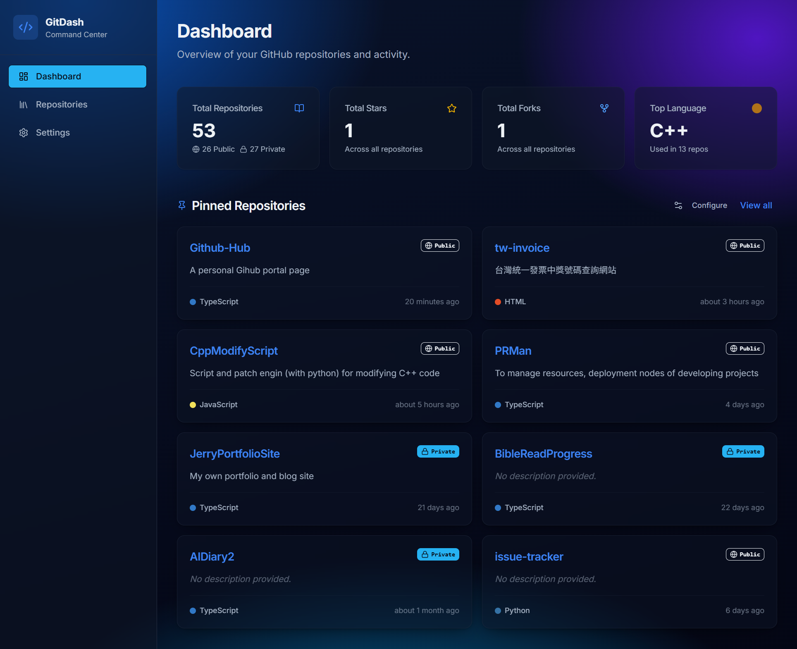
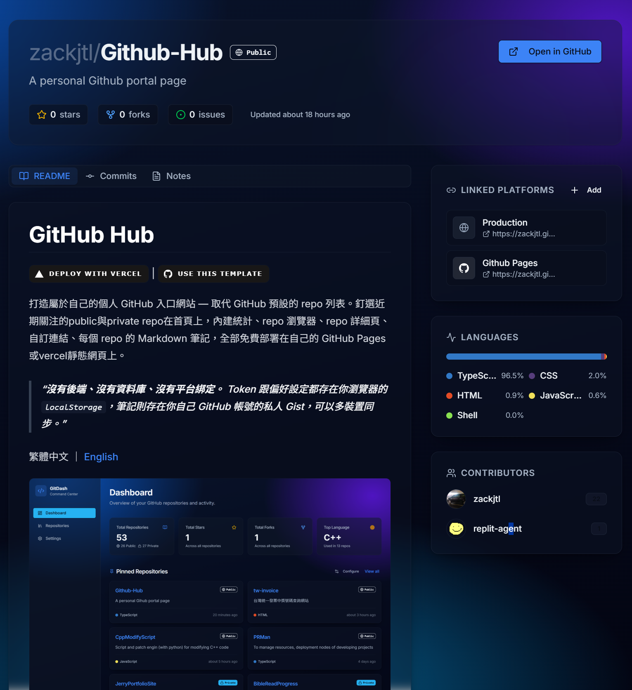
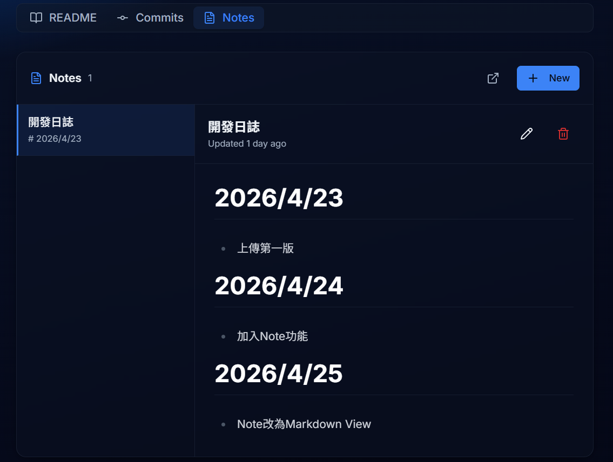

# GitHub Hub

<a href="https://vercel.com/new/clone?repository-url=https://github.com/zackjtl/Github-Hub&root-directory=artifacts%2Fgithub-dashboard" target="_blank" rel="noopener noreferrer"></a> | <a href="../../generate" target="_blank" rel="noopener noreferrer"></a>

打造屬於自己的個人 GitHub 入口網站 — 取代 GitHub 預設的 repo 列表。釘選近期關注的public與private repo在首頁上，內建統計、repo 瀏覽器、repo 詳細頁、自訂連結、每個 repo 的 Markdown 筆記，全部免費部署在自己的 GitHub Pages或vercel靜態網頁上。

> **沒有後端、沒有資料庫、沒有平台綁定。** Token 跟偏好設定都存在你瀏覽器的 `localStorage`，筆記則存在你自己 GitHub 帳號的私人 Gist，可以多裝置同步。

繁體中文 ｜ [English](./README.en.md)



## 功能特色

- 📊 **儀表板** — 活動概覽、熱門 repo、語言統計
- 🔍 **Repo 瀏覽器** — 搜尋與篩選所有 repo
- 📄 **Repo 詳細頁** — README 渲染、metadata、貢獻者
- 🔗 **自訂平台連結** — 為每個 repo 釘選相關連結（部署網址、文件、設計稿…）
- 📝 **Markdown 筆記** — 每個 repo 一份筆記，支援即時預覽，透過私人 Gist 同步
- ⚙️ **可自訂的儀表板** — 自由選擇要顯示在儀表板上的 repo
- 🌗 **預設深色模式**，採用精緻漸層配色

### 自訂平台連結

GitHub 上的 repo 通常只是真正成果的「源頭」 — 實際的網站、文件、設計稿、看板、雲端服務 console 都散落在各個平台。GitHub-Hub 讓你可以為**每個 repo** 釘選任意數量的連結，並依照平台自動套用 icon 與顏色（Vercel、Netlify、Figma、Notion、Linear、Supabase、Firebase、Google Drive…）。

已內建支援的常見平台：


沒列到的平台也能新增，會自動套上通用 icon。

這些連結會顯示在 repo 詳細頁的最上方，一鍵直達相關平台。設定資料只存在你瀏覽器的 `localStorage`，不會外流。

### 截圖

| Repo 詳細頁 | 筆記 |
|---|---|
|  |  |

## 快速開始 — 部署你自己的版本（5 分鐘）

你可以選擇以下其中一種部署方式：

### Vercel 一鍵佈署

- **Step 1.** 點擊頁面上方的 **Deploy with Vercel** 按鈕。
- **Step 2.** 在 Vercel 完成匯入與部署（專案根目錄已預設為 `artifacts/github-dashboard`）。
- **Step 3.** 開啟部署完成後的網址，進入 Setup 畫面。
- **Step 4.** 確認你要使用的 GitHub 使用者名稱（Username）。
- **Step 5.** 到 [GitHub Personal Access Token（classic）頁面](https://github.com/settings/tokens) 申請 Token，勾選權限：**`repo`**、**`user`**、**`gist`**。
- **Step 6.** 回到 Setup 畫面，輸入 GitHub 使用者名稱與 Token。

### GitHub Pages

- **Step 1.** 在 GitHub 頁面上方點 **[Use this template](../../generate)** → **Create a new repository**。取個名字（例如 `my-github-hub`），設為 **Public**（免費 GitHub Pages 必須是公開的）。
- **Step 2.** 到新 repo 的 **Settings → Pages**，在 **Build and deployment → Source** 選 **GitHub Actions**。
- **Step 3.** 回到 **Actions** 頁面，先在左側邊欄點選 **Deploy GitHub Dashboard to Pages**，再到 workflow 卡片右邊點 **Run workflow**。
- **Step 4.** 等待部署成功（綠色 ✅，約 1～2 分鐘），打開：`https://<你的帳號>.github.io/<repo名稱>/`。
- **Step 5.** 到 [GitHub Personal Access Token（classic）頁面](https://github.com/settings/tokens) 申請 Token，勾選權限：**`repo`**、**`user`**、**`gist`**。
- **Step 6.** 回到 Setup 畫面，輸入 GitHub 使用者名稱與 Token。

Token 只會存在你自己的瀏覽器 `localStorage`。其他人來看你的網站也只會看到 Setup 畫面，他們得用自己的 token，看不到你的。

## 本地開發

需求：**Node.js 22+** 與 **pnpm 10+**。

```bash
git clone https://github.com/<你的帳號>/<repo名稱>.git
cd <repo名稱>
pnpm install
pnpm --filter @workspace/github-dashboard run dev
```

開發伺服器啟動後會印出本地網址。Production build 時需要 `BASE_PATH` 環境變數（GitHub Actions workflow 會根據 repo 名自動帶入）。

要在本地預覽 production build：

```bash
BASE_PATH=/ PORT=4173 pnpm --filter @workspace/github-dashboard run build
BASE_PATH=/ PORT=4173 pnpm --filter @workspace/github-dashboard run serve
```

## 運作原理

| 內容 | 儲存位置 |
|---|---|
| GitHub token | `localStorage`（`github_config`）— 只會送到 api.github.com，不會傳到任何其他地方 |
| 主題偏好 | `localStorage`（`theme`）|
| 自訂 repo 連結 | `localStorage`（`repo_links`）|
| 儀表板 repo 選擇 | `localStorage`（`dashboard_prefs`）|
| 筆記內容 | 你 GitHub 帳號上的私人 Gist（一個 repo 一份 Gist，描述標記為 `[gitdash:notes] owner/repo`）|
| 筆記 Gist ID 快取 | `localStorage`（`gitdash_notes_gist_ids`）|

因為筆記放在私人 Gist，所以可以無痛跨裝置同步 — 在新瀏覽器登入相同 token，筆記就會自動出現。

## 技術棧

- React 19 + Vite
- Tailwind CSS v4 + shadcn/ui
- TanStack Query 處理資料抓取
- wouter 路由
- react-markdown + remark-gfm 渲染筆記
- 透過 GitHub Actions 部署到 GitHub Pages

## 客製化

App 程式碼放在 `artifacts/github-dashboard/src/`：

- `pages/` — 主要路由頁面（dashboard、repo-browser、repo-detail、settings）
- `components/` — UI 元件，包含 onboarding 用的 `setup-screen.tsx`
- `hooks/use-github-api.ts` — 所有 GitHub REST API 呼叫
- `index.css` — 漸層主題與設計變數

顏色、tabs、版面隨你改 — 整個都是你的。

## 常見問題

**我的 token 安全嗎？**
安全。它只存在你自己的瀏覽器，只會透過 HTTPS 送到 `api.github.com`，不會被寫進任何 build 產物。即使你去看別人部署的版本，他們也讀不到你的 token。

**可以把 repo 設為 Private 嗎？**
GitHub Pages 對 Private repo 需要 GitHub Pro 帳號。App 本身完全沒問題，只是 hosting 方案不一樣。

**可以使用自訂網域嗎？**
可以。在 `artifacts/github-dashboard/public/` 底下加一個 `CNAME` 檔，內容寫你的網域，再依照 [GitHub 文件](https://docs.github.com/en/pages/configuring-a-custom-domain-for-your-github-pages-site) 設定 DNS。同時要把 workflow 裡的 `BASE_PATH` 改成 `/`。

**筆記存在哪？**
你自己帳號的私人 Gist，一個 repo 一份。儀表板會掃描你的 Gist，靠描述裡的 `[gitdash:notes] owner/repo` 標記找出對應的筆記。

## 授權

MIT — 隨便用、沒有任何擔保。
